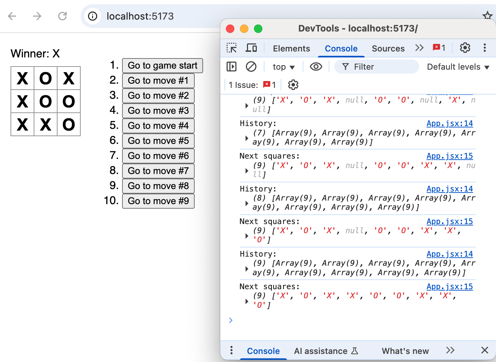
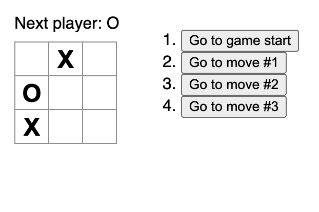

# Fullstack Lab
This is a repository to track my learning path in fullstack development. I will be learning HTML, CSS, JavaScript, React and Node.

## Main Learning Resources
- [Scrimba](https://scrimba.com/fullstack-path-c0fullstack:toc)
    - I am following scrimba's Fullstack Path, as it offers project-based learning of the most fundamental concepts of fullstack development
- [The Odin Project](https://www.theodinproject.com)
- [MDN webdocs](https://developer.mozilla.org/en-US/docs/Learn_web_development)
    - I have been following parts of the Learn Web Development track and this is my main reference when learning and using new concepts/syntax in HTML, CSS, JS
- [Javascript Info](https://javascript.info/)
- [Official React Documentation](https://react.dev/learn/)
    - [Thinking in React](https://react.dev/learn/thinking-in-react) is a good break-down of designing an application in React

## Projects

### Personal Dashboard
- [folder](javascript/async/dashboard/)
- created a personal dashboard with dynamic background image, weather information based on geolocation, bitcoin prices, and time
- usable as chrome extension in my own browser

### Tic-Tac-Toe
- [folder](react/tic-tac-toe/)
- my first project in React following the official [react.dev](https://react.dev/learn/tutorial-tic-tac-toe) tutorial
- learned about _components_ and _states_ in React, as well as the benefits of _immutability_ by storing a history of steps
- touched on _closures_ and _fragments_, too

