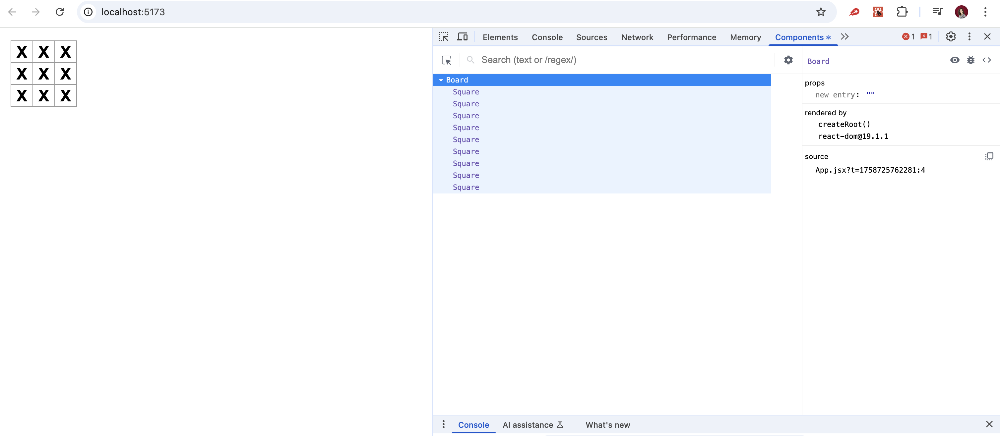
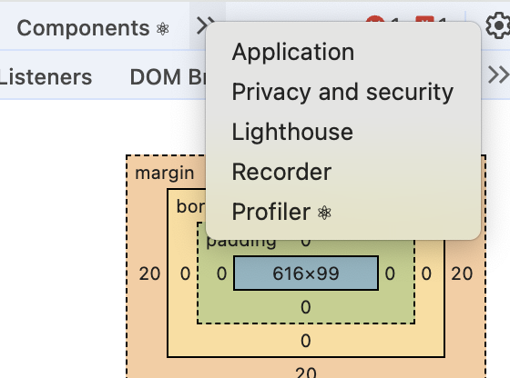

# React
## Components
~: a component is _a piece of reusable code_ that represents a part of a user interface
-> to manage, render, update UI elements

## JSX
~: A JSX element is a combination of _JavaScript code_ and _HTML tags_ that describes what you’d like to display. 
- under the hood, JSX elements are turned into elements by calling createElement
e.g.:
```javascript
<button className="square">X</button>
```

## index.jsx
```javascript
import { StrictMode } from "react"; // React
import { createRoot } from "react-dom/client"; // React’s library to talk to web browsers (React DOM)
import "./styles.css"; // the styles for your components

import App from "./App"; // the component you created
```

## Fragments
`<></>` or <Fragment></Fragment> => to wrap multiple adjacent JSX elements
- does not insert an extra div into the DOM

## States
~: to remember things, components use _states_

## Props
~: Props are how you pass data from a parent component to a child component. They are read-only and help make components reusable.

## Props vs. State
Props and states are the two types of "models" in React, but they areb very different.
- **Props** are arguments that you pass from a parent component to a child component e.g. a `Form` can pass `color` prop to a `Button`
- **State** is like a component's memory and it helps keeping track of interaction e.g. `Button` might keep track of `isHovered` state

## React Developer Tools
This is a cool browser extension that helps you to inspect components. It contains "Profiler" and "Components".



## Re-rendering
- React skips re-rendering when props are unchanged...
- the React Compiler automatically applies this: [memoization](https://react.dev/reference/react/memo)

## Self-closing tags <Component />
[](https://stackoverflow.com/questions/48991212/react-component-closing-tag)
- components in React that don't have a child, are preferably self-closing, while components that have children need to have an ending tag
- in HTML, the rule is a bit different and self-closing tags can onluy be used for void elements like `img`
